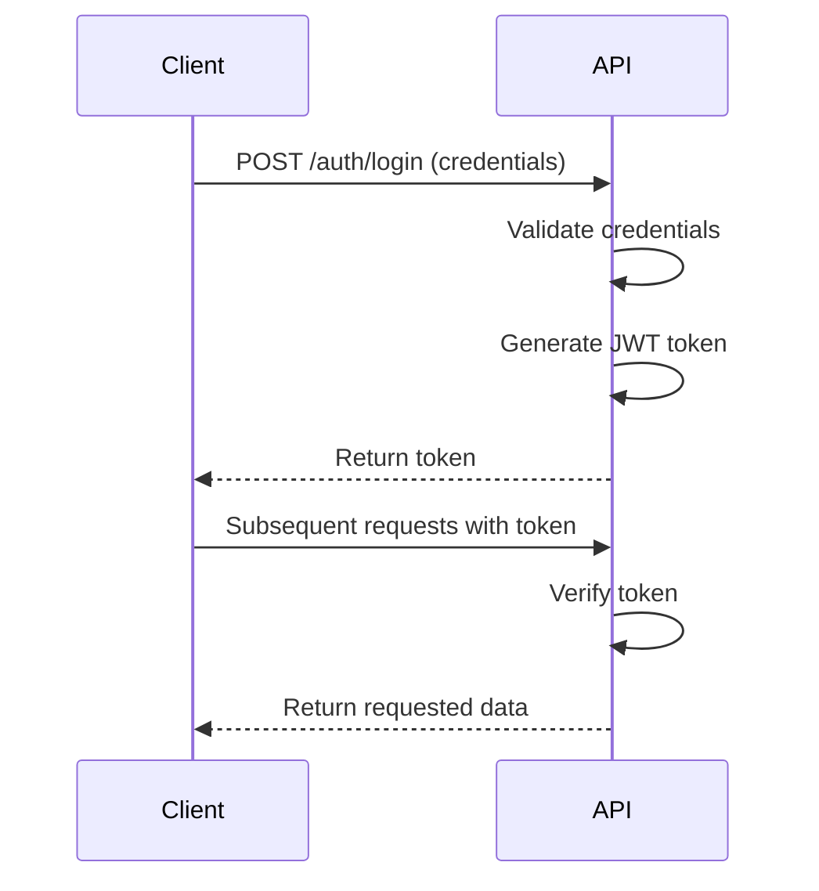

# VibeAnalyzer API - Complete Documentation

**Version:** 1.0.0  
**Base URL:** `https://vibeanalyzer-api.onrender.com`  
**API Version:** v1  
**Last Updated:** January 4, 2026

---

## 📑 Table of Contents

1. [Introduction](#introduction)
2. [Getting Started](#getting-started)
3. [Authentication](#authentication)
4. [API Endpoints](#api-endpoints)
   - [Authentication](#authentication-endpoints)
   - [Users](#users-endpoints)
   - [Projects](#projects-endpoints)
   - [Messages (AI Chat)](#messages-endpoints)
   - [Reports](#reports-endpoints)
   - [Datasets](#datasets-endpoints)
5. [Data Models](#data-models)
6. [File Handling](#file-handling)
7. [Error Handling](#error-handling)
8. [Rate Limits & Constraints](#rate-limits--constraints)
9. [Code Examples](#code-examples)
10. [Best Practices](#best-practices)
11. [Integration Guide](#integration-guide)

---

## Introduction

### What is VibeAnalyzer API?

VibeAnalyzer API is a comprehensive RESTful API that provides AI-powered data analysis capabilities through integration with Anthropic's Claude AI models. It enables developers to build intelligent applications that can analyze datasets, generate visualizations, execute Python code, and create professional reports.

### Key Features

🤖 **AI-Powered Analysis**

- Integration with Claude Sonnet 4.5 and Opus 4
- Intelligent conversation with context preservation
- Multi-turn analysis with container persistence

📊 **Advanced Data Processing**

- Support for CSV, Excel, Word, PDF files
- Python code execution environment
- Statistical analysis with pandas, numpy, scipy
- Visualization generation with matplotlib, seaborn

📁 **Comprehensive File Management**

- Upload multiple files per message
- Active Storage integration
- Generated file tracking
- File metadata and URLs

📈 **Report Generation**

- PDF report creation
- ZIP archives with visualizations
- Metadata tracking
- One report per message constraint

🔐 **Secure & Scalable**

- JWT-based authentication
- User role management
- Project isolation
- PostgreSQL database

### Supported File Types

| Category         | Extensions  | MIME Types                                                              | Max Size |
| ---------------- | ----------- | ----------------------------------------------------------------------- | -------- |
| **Documents**    | .pdf        | application/pdf                                                         | 500 MB   |
| **Spreadsheets** | .csv        | text/csv                                                                | 500 MB   |
|                  | .xlsx       | application/vnd.openxmlformats-officedocument.spreadsheetml.sheet       | 500 MB   |
|                  | .xls        | application/vnd.ms-excel                                                | 500 MB   |
| **Word Docs**    | .docx       | application/vnd.openxmlformats-officedocument.wordprocessingml.document | 500 MB   |
|                  | .doc        | application/msword                                                      | 500 MB   |
| **Images**       | .jpg, .jpeg | image/jpeg                                                              | 500 MB   |
|                  | .png        | image/png                                                               | 500 MB   |
|                  | .gif        | image/gif                                                               | 500 MB   |
|                  | .webp       | image/webp                                                              | 500 MB   |

### Available Claude Models

| Model                 | Model String        | Description                            | Use Case                            |
| --------------------- | ------------------- | -------------------------------------- | ----------------------------------- |
| **Claude Sonnet 4.5** | `claude-sonnet-4-5` | Best balance of speed and intelligence | Default, recommended for most tasks |
| **Claude Opus 4**     | `claude-opus-4`     | Most powerful, highest quality         | Complex analysis, detailed reports  |

**Internal Model Mapping:**

- `claude-sonnet-4-5` → `claude-sonnet-4-5-20250929`
- `claude-opus-4` → `claude-opus-4-20250514`

---

## Getting Started

### Prerequisites

Before using the API, you'll need:

1. **Account Credentials**: Email and password
2. **API Client**: Any HTTP client (curl, Postman, axios, requests)
3. **JWT Token**: Obtained through authentication endpoint

### Quick Start Example

```bash
# 1. Authenticate
curl -X POST https://vibeanalyzer-api.onrender.com/api/v1/auth/login \
  -H "Content-Type: application/json" \
  -d '{"email":"user@example.com","password":"password"}'

# Response: {"token":"eyJhbGciOiJIUzI1NiJ9..."}

# 2. Create a project
curl -X POST https://vibeanalyzer-api.onrender.com/api/v1/projects \
  -H "Authorization: Bearer YOUR_TOKEN" \
  -H "Content-Type: application/json" \
  -d '{"project":{"name":"My Analysis","description":"Data analysis project"}}'

# 3. Send message with file
curl -X POST https://vibeanalyzer-api.onrender.com/api/v1/projects/1/messages \
  -H "Authorization: Bearer YOUR_TOKEN" \
  -F "message[content]=Analyze this dataset" \
  -F "message[model]=claude-sonnet-4-5" \
  -F "files[]=@data.csv"
```

### Base URL

All API requests should be made to:

```
Production: https://vibeanalyzer-api.onrender.com
```

### API Versioning

The current API version is `v1`. All endpoints are prefixed with `/api/v1/`.

---

## Authentication

### Overview

The API uses JWT (JSON Web Tokens) for authentication. After logging in, you receive a token that must be included in the `Authorization` header of subsequent requests.

### Authentication Flow



---

## Authentication Endpoints

### Login

Authenticate a user and receive a JWT token.

**Endpoint:** `POST /api/v1/auth/login`

**Authentication Required:** No

**Request Headers:**

```
Content-Type: application/json
```

**Request Body:**

```json
{
  "email": "string (required, valid email format)",
  "password": "string (required, min 6 characters)"
}
```

**Success Response:**

Status Code: `200 OK`

```json
{
  "token": "eyJhbGciOiJIUzI1NiJ9.eyJ1c2VyX2lkIjoxfQ.abc123..."
}
```

**Error Responses:**

Status Code: `401 Unauthorized`

```json
{
  "error": "Invalid email or password"
}
```

**Token Details:**

- **Algorithm:** HS256
- **Expiration:** No expiration (store securely)
- **Payload:** `{ "user_id": integer }`
- **Secret:** Server-side `Rails.application.secret_key_base`

**Example Requests:**

<details>
<summary><b>cURL</b></summary>

```bash
curl -X POST https://vibeanalyzer-api.onrender.com/api/v1/auth/login \
  -H "Content-Type: application/json" \
  -d '{
    "email": "john.doe@example.com",
    "password": "SecurePass123"
  }'
```

</details>

<details>
<summary><b>JavaScript (Fetch)</b></summary>

```javascript
const response = await fetch(
  "https://vibeanalyzer-api.onrender.com/api/v1/auth/login",
  {
    method: "POST",
    headers: {
      "Content-Type": "application/json",
    },
    body: JSON.stringify({
      email: "john.doe@example.com",
      password: "SecurePass123",
    }),
  }
);

const data = await response.json();
const token = data.token;

// Store token for subsequent requests
localStorage.setItem("authToken", token);
```

</details>

<details>
<summary><b>Python (requests)</b></summary>

```python
import requests

url = 'https://vibeanalyzer-api.onrender.com/api/v1/auth/login'
payload = {
    'email': 'john.doe@example.com',
    'password': 'SecurePass123'
}

response = requests.post(url, json=payload)
data = response.json()
token = data['token']

# Store token for subsequent requests
print(f"Token: {token}")
```

</details>

---

## Users Endpoints

### List All Users

Retrieve a list of all users in the system.

**Endpoint:** `GET /api/v1/users`

**Authentication Required:** Yes

**Request Headers:**

```
Authorization: Bearer <token>
```

**Query Parameters:** None

**Success Response:**

Status Code: `200 OK`

```json
[
  {
    "id": 1,
    "name": "John Doe",
    "email": "john@example.com",
    "role": "researcher",
    "created_at": "2025-11-05T12:00:00.000Z",
    "updated_at": "2025-11-05T12:00:00.000Z"
  },
  {
    "id": 2,
    "name": "Jane Smith",
    "email": "jane@example.com",
    "role": "student",
    "created_at": "2025-11-06T10:30:00.000Z",
    "updated_at": "2025-11-06T10:30:00.000Z"
  }
]
```

**Example Request:**

```bash
curl -X GET https://vibeanalyzer-api.onrender.com/api/v1/users \
  -H "Authorization: Bearer YOUR_TOKEN"
```

---

### Get User

Retrieve details of a specific user by ID.

**Endpoint:** `GET /api/v1/users/:id`

**Authentication Required:** Yes

**URL Parameters:**

- `id` (integer, required) - User ID

**Request Headers:**

```
Authorization: Bearer <token>
```

**Success Response:**

Status Code: `200 OK`

```json
{
  "id": 1,
  "name": "John Doe",
  "email": "john@example.com",
  "role": "researcher",
  "created_at": "2025-11-05T12:00:00.000Z",
  "updated_at": "2025-11-05T12:00:00.000Z"
}
```

**Error Response:**

Status Code: `404 Not Found`

```json
{
  "error": "User not found"
}
```

**Example Request:**

```bash
curl -X GET https://vibeanalyzer-api.onrender.com/api/v1/users/1 \
  -H "Authorization: Bearer YOUR_TOKEN"
```

---

### Create User

Create a new user account (registration).

**Endpoint:** `POST /api/v1/users`

**Authentication Required:** No

**Request Headers:**

```
Content-Type: application/json
```

**Request Body:**

```json
{
  "user": {
    "name": "string (required)",
    "email": "string (required, unique, valid email format)",
    "password": "string (required, min 6 characters)",
    "password_confirmation": "string (required, must match password)",
    "role": "string (optional: 'student'|'researcher'|'admin', default: 'researcher')"
  }
}
```

**Field Validations:**

- `name`: Required, any string
- `email`: Required, unique, valid email format (regex: `URI::MailTo::EMAIL_REGEXP`)
- `password`: Required, minimum 6 characters
- `password_confirmation`: Must match `password`
- `role`: Optional, one of: `student`, `researcher`, `admin` (default: `researcher`)

**Success Response:**

Status Code: `201 Created`

```json
{
  "id": 3,
  "name": "Alice Johnson",
  "email": "alice@example.com",
  "role": "researcher",
  "created_at": "2025-12-08T14:22:00.000Z",
  "updated_at": "2025-12-08T14:22:00.000Z"
}
```

**Error Response:**

Status Code: `422 Unprocessable Entity`

```json
{
  "email": ["has already been taken"],
  "password": ["is too short (minimum is 6 characters)"],
  "password_confirmation": ["doesn't match Password"]
}
```

**Example Requests:**

<details>
<summary><b>cURL</b></summary>

```bash
curl -X POST https://vibeanalyzer-api.onrender.com/api/v1/users \
  -H "Content-Type: application/json" \
  -d '{
    "user": {
      "name": "Alice Johnson",
      "email": "alice@example.com",
      "password": "SecurePass456",
      "password_confirmation": "SecurePass456",
      "role": "researcher"
    }
  }'
```

</details>

<details>
<summary><b>JavaScript</b></summary>

```javascript
const response = await fetch(
  "https://vibeanalyzer-api.onrender.com/api/v1/users",
  {
    method: "POST",
    headers: {
      "Content-Type": "application/json",
    },
    body: JSON.stringify({
      user: {
        name: "Alice Johnson",
        email: "alice@example.com",
        password: "SecurePass456",
        password_confirmation: "SecurePass456",
        role: "researcher",
      },
    }),
  }
);

const user = await response.json();
```

</details>

---

### Update User

Update an existing user's information.

**Endpoint:** `PUT /api/v1/users/:id` or `PATCH /api/v1/users/:id`

**Authentication Required:** Yes

**URL Parameters:**

- `id` (integer, required) - User ID

**Request Headers:**

```
Authorization: Bearer <token>
Content-Type: application/json
```

**Request Body:**

```json
{
  "user": {
    "name": "string (optional)",
    "email": "string (optional, must be unique)",
    "password": "string (optional, min 6 characters)",
    "password_confirmation": "string (optional, required if password provided)",
    "role": "string (optional: 'student'|'researcher'|'admin')"
  }
}
```

**Success Response:**

Status Code: `200 OK`

```json
{
  "id": 1,
  "name": "John Doe Updated",
  "email": "john.updated@example.com",
  "role": "admin",
  "created_at": "2025-11-05T12:00:00.000Z",
  "updated_at": "2025-12-08T15:30:00.000Z"
}
```

**Error Response:**

Status Code: `422 Unprocessable Entity`

```json
{
  "email": ["has already been taken"]
}
```

**Example Request:**

```bash
curl -X PUT https://vibeanalyzer-api.onrender.com/api/v1/users/1 \
  -H "Authorization: Bearer YOUR_TOKEN" \
  -H "Content-Type: application/json" \
  -d '{
    "user": {
      "name": "John Doe Updated",
      "role": "admin"
    }
  }'
```

---

### Delete User

Delete a user account.

**Endpoint:** `DELETE /api/v1/users/:id`

**Authentication Required:** Yes

**URL Parameters:**

- `id` (integer, required) - User ID

**Request Headers:**

```
Authorization: Bearer <token>
```

**Success Response:**

Status Code: `200 OK`

```json
{
  "message": "User deleted successfully"
}
```

**Error Response:**

Status Code: `404 Not Found`

```json
{
  "error": "User not found"
}
```

**Cascade Deletion:**

When a user is deleted, the following associated records are also deleted:

- All projects owned by the user
- All messages in those projects
- All reports created by the user

**Example Request:**

```bash
curl -X DELETE https://vibeanalyzer-api.onrender.com/api/v1/users/1 \
  -H "Authorization: Bearer YOUR_TOKEN"
```

---

## Projects Endpoints

### List All Projects

Retrieve all projects owned by the authenticated user.

**Endpoint:** `GET /api/v1/projects`

**Authentication Required:** Yes

**Request Headers:**

```
Authorization: Bearer <token>
```

**Success Response:**

Status Code: `200 OK`

```json
[
  {
    "id": 1,
    "name": "Sales Analysis Q4",
    "description": "Quarterly sales data analysis",
    "user_id": 1,
    "created_at": "2025-11-05T12:00:00.000Z",
    "updated_at": "2025-11-05T12:00:00.000Z"
  },
  {
    "id": 2,
    "name": "Customer Behavior Study",
    "description": "Analysis of customer purchase patterns",
    "user_id": 1,
    "created_at": "2025-11-06T09:15:00.000Z",
    "updated_at": "2025-11-06T09:15:00.000Z"
  }
]
```

**Example Request:**

```bash
curl -X GET https://vibeanalyzer-api.onrender.com/api/v1/projects \
  -H "Authorization: Bearer YOUR_TOKEN"
```

---

### Get Project

Retrieve details of a specific project.

**Endpoint:** `GET /api/v1/projects/:id`

**Authentication Required:** Yes

**URL Parameters:**

- `id` (integer, required) - Project ID

**Request Headers:**

```
Authorization: Bearer <token>
```

**Success Response:**

Status Code: `200 OK`

```json
{
  "id": 1,
  "name": "Sales Analysis Q4",
  "description": "Quarterly sales data analysis",
  "user_id": 1,
  "created_at": "2025-11-05T12:00:00.000Z",
  "updated_at": "2025-11-05T12:00:00.000Z"
}
```

**Error Response:**

Status Code: `404 Not Found`

```json
{
  "error": "Project not found or you do not have permission"
}
```

**Authorization:**
Users can only access their own projects. Attempting to access another user's project will result in a 404 error.

**Example Request:**

```bash
curl -X GET https://vibeanalyzer-api.onrender.com/api/v1/projects/1 \
  -H "Authorization: Bearer YOUR_TOKEN"
```

---

### Create Project

Create a new project.

**Endpoint:** `POST /api/v1/projects`

**Authentication Required:** Yes

**Request Headers:**

```
Authorization: Bearer <token>
Content-Type: application/json
```

**Request Body:**

```json
{
  "project": {
    "name": "string (required)",
    "description": "string (optional)"
  }
}
```

**Success Response:**

Status Code: `201 Created`

```json
{
  "id": 3,
  "name": "Market Research 2026",
  "description": "Consumer trends analysis",
  "user_id": 1,
  "created_at": "2025-12-08T16:45:00.000Z",
  "updated_at": "2025-12-08T16:45:00.000Z"
}
```

**Error Response:**

Status Code: `422 Unprocessable Entity`

```json
{
  "name": ["can't be blank"]
}
```

**Example Request:**

```bash
curl -X POST https://vibeanalyzer-api.onrender.com/api/v1/projects \
  -H "Authorization: Bearer YOUR_TOKEN" \
  -H "Content-Type: application/json" \
  -d '{
    "project": {
      "name": "Market Research 2026",
      "description": "Consumer trends analysis"
    }
  }'
```

---

### Update Project

Update project details.

**Endpoint:** `PUT /api/v1/projects/:id` or `PATCH /api/v1/projects/:id`

**Authentication Required:** Yes

**URL Parameters:**

- `id` (integer, required) - Project ID

**Request Headers:**

```
Authorization: Bearer <token>
Content-Type: application/json
```

**Request Body:**

```json
{
  "project": {
    "name": "string (optional)",
    "description": "string (optional)"
  }
}
```

**Success Response:**

Status Code: `200 OK`

```json
{
  "id": 1,
  "name": "Sales Analysis Q4 - Updated",
  "description": "Updated quarterly analysis including December data",
  "user_id": 1,
  "created_at": "2025-11-05T12:00:00.000Z",
  "updated_at": "2025-12-08T17:20:00.000Z"
}
```

**Example Request:**

```bash
curl -X PUT https://vibeanalyzer-api.onrender.com/api/v1/projects/1 \
  -H "Authorization: Bearer YOUR_TOKEN" \
  -H "Content-Type: application/json" \
  -d '{
    "project": {
      "description": "Updated quarterly analysis including December data"
    }
  }'
```

---

### Delete Project

Delete a project and all associated data.

**Endpoint:** `DELETE /api/v1/projects/:id`

**Authentication Required:** Yes

**URL Parameters:**

- `id` (integer, required) - Project ID

**Request Headers:**

```
Authorization: Bearer <token>
```

**Success Response:**

Status Code: `200 OK`

```json
{
  "message": "Project deleted successfully"
}
```

**Cascade Deletion:**

When a project is deleted, the following associated records are also deleted:

- All messages in the project
- All reports associated with the project
- All file attachments

**Example Request:**

```bash
curl -X DELETE https://vibeanalyzer-api.onrender.com/api/v1/projects/1 \
  -H "Authorization: Bearer YOUR_TOKEN"
```

---

## Messages Endpoints

Messages represent the conversation with Claude AI. Each message can include text content and file attachments.

### Get Conversation History

Retrieve all messages for a specific project in chronological order.

**Endpoint:** `GET /api/v1/projects/:project_id/messages`

**Authentication Required:** Yes

**URL Parameters:**

- `project_id` (integer, required) - Project ID

**Request Headers:**

```
Authorization: Bearer <token>
```

**Success Response:**

Status Code: `200 OK`

```json
{
  "project_id": 1,
  "messages": [
    {
      "id": 1,
      "role": "user",
      "content": "Analyze this dataset and calculate summary statistics",
      "attachments": [
        {
          "id": 1,
          "file_id": "file_abc123xyz",
          "filename": "sales_data.csv",
          "content_type": "text/csv",
          "byte_size": 15420,
          "url": "/rails/active_storage/blobs/redirect/xyz123.../sales_data.csv"
        }
      ],
      "created_at": "2025-12-08T10:00:00.000Z"
    },
    {
      "id": 2,
      "role": "assistant",
      "content": "I've analyzed the sales data. Here are the summary statistics:\n\nMean: $45,230\nMedian: $42,100\nStd Dev: $12,450...",
      "attachments": [
        {
          "id": 2,
          "file_id": "file_def456uvw",
          "filename": "sales_distribution.png",
          "content_type": "image/png",
          "byte_size": 89234,
          "url": "/rails/active_storage/blobs/redirect/abc456.../sales_distribution.png"
        }
      ],
      "created_at": "2025-12-08T10:01:15.000Z"
    }
  ]
}
```

**Response Structure:**

Each message contains:

- `id`: Unique message identifier
- `role`: Either `"user"` or `"assistant"`
- `content`: Text content of the message
- `attachments`: Array of file attachments
- `created_at`: ISO 8601 timestamp

Each attachment contains:

- `id`: Active Storage attachment ID
- `file_id`: Claude Files API ID (for API-uploaded files)
- `filename`: Original filename
- `content_type`: MIME type
- `byte_size`: File size in bytes
- `url`: Download URL (requires authentication)

**Example Request:**

```bash
curl -X GET https://vibeanalyzer-api.onrender.com/api/v1/projects/1/messages \
  -H "Authorization: Bearer YOUR_TOKEN"
```

---

### Send Message to AI

Send a message to Claude AI with optional file attachments. This creates both a user message and an assistant response.

**Endpoint:** `POST /api/v1/projects/:project_id/messages`

**Authentication Required:** Yes

**URL Parameters:**

- `project_id` (integer, required) - Project ID

**Request Headers:**

```
Authorization: Bearer <token>
Content-Type: multipart/form-data
```

**Form Parameters:**

| Parameter               | Type    | Required | Default             | Description                        |
| ----------------------- | ------- | -------- | ------------------- | ---------------------------------- |
| `message[content]`      | string  | Yes      | -                   | Message text to send to Claude     |
| `message[model]`        | string  | No       | `claude-sonnet-4-5` | AI model to use                    |
| `files[]`               | file(s) | No       | -                   | One or more files to attach        |
| `enable_code_execution` | boolean | No       | `true`              | Enable Python code execution       |
| `container_id`          | string  | No       | -                   | Reuse existing execution container |

**Model Options:**

- `claude-sonnet-4-5`: Recommended, best balance (default)
- `claude-opus-4`: Most capable, slower

**Code Execution:**

When `enable_code_execution` is `true` (default):

- CSV files are uploaded to Claude Files API for direct access in code
- Python 3.11 environment available with pandas, numpy, scipy, matplotlib, seaborn
- 5GB RAM, 5GB disk space
- Containers persist for 30 days
- Can be reused with `container_id` parameter

**File Processing Logic:**

1. **CSV files** (with code execution):

   - Uploaded to Claude Files API
   - Available for analysis in Python environment
   - Stored in Active Storage

2. **Word/Excel files** (.docx, .xlsx):

   - Converted to text
   - Text appended to message content
   - Original file stored in Active Storage

3. **PDF files**:

   - Uploaded to Claude Files API
   - Processed by Claude's document understanding
   - Stored in Active Storage

4. **Images** (.jpg, .png, .gif, .webp):
   - Uploaded to Claude Files API
   - Processed by Claude's vision capabilities
   - Stored in Active Storage

**Success Response:**

Status Code: `201 Created`

```json
{
  "user_message": {
    "id": 15,
    "role": "user",
    "content": "Calculate correlation between sales and temperature",
    "attachments": [
      {
        "id": 10,
        "file_id": "file_xyz789abc",
        "filename": "weather_sales.csv",
        "content_type": "text/csv",
        "byte_size": 23456,
        "url": "/rails/active_storage/blobs/redirect/def789.../weather_sales.csv"
      }
    ],
    "created_at": "2025-12-08T14:30:00.000Z"
  },
  "assistant_message": {
    "id": 16,
    "role": "assistant",
    "content": "I've calculated the correlation between sales and temperature:\n\nPearson correlation: 0.73\np-value: 0.001\n\nThere's a strong positive correlation...",
    "attachments": [
      {
        "id": 11,
        "file_id": "file_uvw123def",
        "filename": "correlation_plot.png",
        "content_type": "image/png",
        "byte_size": 67890,
        "url": "/rails/active_storage/blobs/redirect/ghi123.../correlation_plot.png"
      }
    ],
    "created_at": "2025-12-08T14:30:45.000Z"
  },
  "container_id": "cont_abc123xyz789",
  "model_used": "claude-sonnet-4-5"
}
```

**Response Fields:**

- `user_message`: The message you sent
- `assistant_message`: Claude's response
- `container_id`: Container ID for reuse (if code execution enabled)
- `model_used`: Model that processed the request

**Error Response:**

Status Code: `422 Unprocessable Entity`

```json
{
  "error": "Failed to generate response: Rate limit exceeded"
}
```

**Example Requests:**

<details>
<summary><b>cURL - Simple Text Message</b></summary>

```bash
curl -X POST https://vibeanalyzer-api.onrender.com/api/v1/projects/1/messages \
  -H "Authorization: Bearer YOUR_TOKEN" \
  -F "message[content]=What statistical tests should I use for comparing two groups?" \
  -F "message[model]=claude-sonnet-4-5"
```

</details>

<details>
<summary><b>cURL - With File Upload</b></summary>

```bash
curl -X POST https://vibeanalyzer-api.onrender.com/api/v1/projects/1/messages \
  -H "Authorization: Bearer YOUR_TOKEN" \
  -F "message[content]=Analyze this dataset and create visualizations" \
  -F "message[model]=claude-sonnet-4-5" \
  -F "files[]=@/path/to/data.csv" \
  -F "enable_code_execution=true"
```

</details>

<details>
<summary><b>cURL - Multiple Files</b></summary>

```bash
curl -X POST https://vibeanalyzer-api.onrender.com/api/v1/projects/1/messages \
  -H "Authorization: Bearer YOUR_TOKEN" \
  -F "message[content]=Compare these datasets" \
  -F "files[]=@dataset1.csv" \
  -F "files[]=@dataset2.csv" \
  -F "files[]=@reference_chart.png"
```

</details>

<details>
<summary><b>cURL - Reusing Container</b></summary>

```bash
# First message (creates container)
curl -X POST https://vibeanalyzer-api.onrender.com/api/v1/projects/1/messages \
  -H "Authorization: Bearer YOUR_TOKEN" \
  -F "message[content]=Load this dataset and calculate mean" \
  -F "files[]=@data.csv"

# Response includes: "container_id": "cont_abc123"

# Follow-up message (reuses container)
curl -X POST https://vibeanalyzer-api.onrender.com/api/v1/projects/1/messages \
  -H "Authorization: Bearer YOUR_TOKEN" \
  -F "message[content]=Now create a histogram" \
  -F "container_id=cont_abc123"
```

</details>

<details>
<summary><b>JavaScript - With File Upload</b></summary>

```javascript
async function sendMessage(projectId, content, files = []) {
  const formData = new FormData();
  formData.append("message[content]", content);
  formData.append("message[model]", "claude-sonnet-4-5");
  formData.append("enable_code_execution", "true");

  // Add files
  files.forEach((file) => {
    formData.append("files[]", file);
  });

  const response = await fetch(
    `https://vibeanalyzer-api.onrender.com/api/v1/projects/${projectId}/messages`,
    {
      method: "POST",
      headers: {
        Authorization: `Bearer ${token}`,
      },
      body: formData,
    }
  );

  return await response.json();
}

// Usage
const fileInput = document.getElementById("fileInput");
const files = Array.from(fileInput.files);

const result = await sendMessage(1, "Analyze this dataset", files);

console.log("User message:", result.user_message);
console.log("AI response:", result.assistant_message);
console.log("Container ID:", result.container_id);
```

</details>

<details>
<summary><b>Python - With File Upload</b></summary>

```python
import requests

def send_message(project_id, content, file_paths=None, container_id=None):
    url = f'https://vibeanalyzer-api.onrender.com/api/v1/projects/{project_id}/messages'

    headers = {
        'Authorization': f'Bearer {token}'
    }

    data = {
        'message[content]': content,
        'message[model]': 'claude-sonnet-4-5',
        'enable_code_execution': 'true'
    }

    if container_id:
        data['container_id'] = container_id

    files = []
    if file_paths:
        for file_path in file_paths:
            files.append(('files[]', open(file_path, 'rb')))

    try:
        response = requests.post(url, headers=headers, data=data, files=files)
        return response.json()
    finally:
        # Close file handles
        for _, file_handle in files:
            file_handle.close()

# Usage
result = send_message(
    project_id=1,
    content='Analyze this dataset and create summary statistics',
    file_paths=['data.csv']
)

print(f"Assistant: {result['assistant_message']['content']}")
print(f"Container ID: {result['container_id']}")

# Follow-up with same container
result2 = send_message(
    project_id=1,
    content='Now create a box plot',
    container_id=result['container_id']
)
```

</details>

---

### Get Uploaded Files

Get all files uploaded by the user in this specific project.

**Endpoint:** `GET /api/v1/projects/:project_id/messages/uploaded_files`

**Authentication Required:** Yes

**URL Parameters:**

- `project_id` (integer, required) - Project ID

**Request Headers:**

```
Authorization: Bearer <token>
```

**Success Response:**

Status Code: `200 OK`

```json
{
  "project_id": 1,
  "total_count": 3,
  "uploaded_files": [
    {
      "id": 5,
      "file_id": "file_abc123",
      "filename": "sales_q1.csv",
      "content_type": "text/csv",
      "byte_size": 15420,
      "url": "/rails/active_storage/blobs/redirect/xyz123.../sales_q1.csv",
      "message_id": 8,
      "uploaded_at": "2025-12-08T10:00:00.000Z"
    },
    {
      "id": 7,
      "file_id": "file_def456",
      "filename": "customer_data.xlsx",
      "content_type": "application/vnd.openxmlformats-officedocument.spreadsheetml.sheet",
      "byte_size": 234567,
      "url": "/rails/active_storage/blobs/redirect/abc456.../customer_data.xlsx",
      "message_id": 12,
      "uploaded_at": "2025-12-08T11:30:00.000Z"
    }
  ]
}
```

**Example Request:**

```bash
curl -X GET https://vibeanalyzer-api.onrender.com/api/v1/projects/1/messages/uploaded_files \
  -H "Authorization: Bearer YOUR_TOKEN"
```

---

### Get Generated Files

Get all files generated by AI (visualizations, analysis results) in this project.

**Endpoint:** `GET /api/v1/projects/:project_id/messages/generated_files`

**Authentication Required:** Yes

**URL Parameters:**

- `project_id` (integer, required) - Project ID

**Request Headers:**

```
Authorization: Bearer <token>
```

**Success Response:**

Status Code: `200 OK`

```json
{
  "project_id": 1,
  "total_count": 2,
  "generated_files": [
    {
      "id": 9,
      "file_id": "file_gen123",
      "filename": "sales_histogram.png",
      "content_type": "image/png",
      "byte_size": 67890,
      "url": "/rails/active_storage/blobs/redirect/gen123.../sales_histogram.png",
      "message_id": 9,
      "generated_at": "2025-12-08T10:05:30.000Z"
    },
    {
      "id": 11,
      "file_id": "file_gen456",
      "filename": "correlation_matrix.png",
      "content_type": "image/png",
      "byte_size": 89234,
      "url": "/rails/active_storage/blobs/redirect/gen456.../correlation_matrix.png",
      "message_id": 13,
      "generated_at": "2025-12-08T11:45:22.000Z"
    }
  ]
}
```

**Example Request:**

```bash
curl -X GET https://vibeanalyzer-api.onrender.com/api/v1/projects/1/messages/generated_files \
  -H "Authorization: Bearer YOUR_TOKEN"
```

---

### Clear Conversation

Delete all messages in a project.

**Endpoint:** `DELETE /api/v1/projects/:project_id/messages`

**Authentication Required:** Yes

**URL Parameters:**

- `project_id` (integer, required) - Project ID

**Request Headers:**

```
Authorization: Bearer <token>
```

**Success Response:**

Status Code: `200 OK`

```json
{
  "message": "All messages deleted successfully"
}
```

**Warning:**
This action permanently deletes all conversation history and associated files in the project. This action cannot be undone.

**Example Request:**

```bash
curl -X DELETE https://vibeanalyzer-api.onrender.com/api/v1/projects/1/messages \
  -H "Authorization: Bearer YOUR_TOKEN"
```

---

## Reports Endpoints

Reports are PDF documents with optional ZIP archives containing images and visualizations. Each message can have only one report.

### List Reports

Retrieve a paginated list of all reports for a project.

**Endpoint:** `GET /api/v1/projects/:project_id/reports`

**Authentication Required:** Yes

**URL Parameters:**

- `project_id` (integer, required) - Project ID

**Query Parameters:**

| Parameter  | Type    | Required | Default | Description               |
| ---------- | ------- | -------- | ------- | ------------------------- |
| `page`     | integer | No       | 1       | Page number (starts at 1) |
| `per_page` | integer | No       | 20      | Items per page (max 100)  |

**Request Headers:**

```
Authorization: Bearer <token>
```

**Success Response:**

Status Code: `200 OK`

```json
{
  "project_id": 1,
  "total_count": 15,
  "current_page": 1,
  "per_page": 20,
  "total_pages": 1,
  "reports": [
    {
      "id": 5,
      "message_id": 23,
      "title": "Sales Analysis Q4",
      "report_type": "pdf_with_images",
      "status": "ready",
      "file_size_bytes": 850000,
      "pdf_url": "/rails/active_storage/blobs/redirect/abc123.../report.pdf",
      "zip_url": "/rails/active_storage/blobs/redirect/def456.../images.zip",
      "created_at": "2025-12-08T14:00:00.000Z"
    },
    {
      "id": 4,
      "message_id": 19,
      "title": "Customer Behavior Study",
      "report_type": "pdf_only",
      "status": "ready",
      "file_size_bytes": 245000,
      "pdf_url": "/rails/active_storage/blobs/redirect/ghi789.../report.pdf",
      "zip_url": null,
      "created_at": "2025-12-07T10:30:00.000Z"
    }
  ]
}
```

**Example Request:**

```bash
curl -X GET "https://vibeanalyzer-api.onrender.com/api/v1/projects/1/reports?page=1&per_page=20" \
  -H "Authorization: Bearer YOUR_TOKEN"
```

---

### Get Report Details

Retrieve detailed information about a specific report.

**Endpoint:** `GET /api/v1/projects/:project_id/reports/:id`

**Authentication Required:** Yes

**URL Parameters:**

- `project_id` (integer, required) - Project ID
- `id` (integer, required) - Report ID

**Request Headers:**

```
Authorization: Bearer <token>
```

**Success Response:**

Status Code: `200 OK`

```json
{
  "id": 5,
  "project_id": 1,
  "message_id": 23,
  "user_id": 2,
  "title": "Sales Analysis Q4",
  "report_type": "pdf_with_images",
  "status": "ready",
  "file_size_bytes": 850000,
  "metadata": {
    "chart_count": 5,
    "pdf_pages": 12,
    "included_images": [
      "sales_trend.png",
      "regional_breakdown.png",
      "product_performance.png",
      "correlation_matrix.png",
      "forecast_chart.png"
    ],
    "generation_time_ms": 680,
    "analysis_content_length": 2450
  },
  "pdf_url": "/rails/active_storage/blobs/redirect/abc123.../report.pdf",
  "zip_url": "/rails/active_storage/blobs/redirect/def456.../images.zip",
  "created_at": "2025-12-08T14:00:00.000Z"
}
```

**Error Response:**

Status Code: `404 Not Found`

```json
{
  "error": "Report not found"
}
```

**Example Request:**

```bash
curl -X GET https://vibeanalyzer-api.onrender.com/api/v1/projects/1/reports/5 \
  -H "Authorization: Bearer YOUR_TOKEN"
```

---

### Create Report

Create a new report with uploaded PDF and optional ZIP files.

**Endpoint:** `POST /api/v1/projects/:project_id/reports`

**Authentication Required:** Yes

**URL Parameters:**

- `project_id` (integer, required) - Project ID

**Request Headers:**

```
Authorization: Bearer <token>
Content-Type: multipart/form-data
```

**Form Parameters:**

| Parameter             | Type        | Required    | Max Size | Description                                         |
| --------------------- | ----------- | ----------- | -------- | --------------------------------------------------- |
| `report[message_id]`  | integer     | Yes         | -        | ID of message this report is based on               |
| `report[report_type]` | string      | Yes         | -        | `"pdf_only"` or `"pdf_with_images"`                 |
| `report[metadata]`    | JSON string | No          | -        | Additional metadata (JSON format)                   |
| `pdf_file`            | file        | Yes         | 50 MB    | PDF report file                                     |
| `zip_file`            | file        | Conditional | 100 MB   | ZIP archive (required if type is `pdf_with_images`) |

**Important Notes:**

- Title is automatically set from the project name
- Each message can only have ONE report
- If a report already exists for the message, the existing report is returned (200 OK) instead of creating a duplicate

**Success Response (New Report):**

Status Code: `201 Created`

```json
{
  "id": 6,
  "project_id": 1,
  "message_id": 25,
  "user_id": 2,
  "title": "Sales Analysis Q4",
  "report_type": "pdf_with_images",
  "status": "ready",
  "file_size_bytes": 950000,
  "metadata": {
    "chart_count": 6,
    "pdf_pages": 15,
    "included_images": ["chart1.png", "chart2.png", "chart3.png"],
    "generation_time_ms": 450
  },
  "pdf_url": "/rails/active_storage/blobs/redirect/new123.../report.pdf",
  "zip_url": "/rails/active_storage/blobs/redirect/new456.../images.zip",
  "created_at": "2025-12-08T15:30:00.000Z"
}
```

**Success Response (Duplicate - Existing Report Returned):**

Status Code: `200 OK`

```json
{
  "id": 5,
  "project_id": 1,
  "message_id": 25,
  "user_id": 2,
  "title": "Sales Analysis Q4",
  "report_type": "pdf_with_images",
  "status": "ready",
  "file_size_bytes": 850000,
  "metadata": {
    "chart_count": 5,
    "pdf_pages": 12
  },
  "pdf_url": "/rails/active_storage/blobs/redirect/abc123.../report.pdf",
  "zip_url": "/rails/active_storage/blobs/redirect/def456.../images.zip",
  "created_at": "2025-12-08T14:00:00.000Z",
  "notice": "A report already exists for this message. Returning existing report."
}
```

**Error Responses:**

Status Code: `422 Unprocessable Entity`

```json
{
  "error": "Validation failed",
  "details": {
    "pdf_file": ["must be attached"]
  }
}
```

```json
{
  "error": "Validation failed",
  "details": {
    "message_id": ["Message not found or does not belong to this project"]
  }
}
```

**Example Requests:**

<details>
<summary><b>cURL - PDF Only</b></summary>

```bash
curl -X POST https://vibeanalyzer-api.onrender.com/api/v1/projects/1/reports \
  -H "Authorization: Bearer YOUR_TOKEN" \
  -F "report[message_id]=25" \
  -F "report[report_type]=pdf_only" \
  -F 'report[metadata]={"pdf_pages":10}' \
  -F "pdf_file=@/path/to/report.pdf"
```

</details>

<details>
<summary><b>cURL - PDF with Images</b></summary>

```bash
curl -X POST https://vibeanalyzer-api.onrender.com/api/v1/projects/1/reports \
  -H "Authorization: Bearer YOUR_TOKEN" \
  -F "report[message_id]=25" \
  -F "report[report_type]=pdf_with_images" \
  -F 'report[metadata]={"chart_count":5,"pdf_pages":15,"included_images":["chart1.png","chart2.png"]}' \
  -F "pdf_file=@report.pdf" \
  -F "zip_file=@images.zip"
```

</details>

<details>
<summary><b>JavaScript</b></summary>

```javascript
async function createReport(projectId, messageId, pdfBlob, zipBlob = null) {
  const formData = new FormData();

  formData.append("report[message_id]", messageId);
  formData.append(
    "report[report_type]",
    zipBlob ? "pdf_with_images" : "pdf_only"
  );

  const metadata = {
    chart_count: 5,
    pdf_pages: 12,
    generation_time_ms: Date.now() - startTime,
  };
  formData.append("report[metadata]", JSON.stringify(metadata));

  formData.append("pdf_file", pdfBlob, "report.pdf");
  if (zipBlob) {
    formData.append("zip_file", zipBlob, "images.zip");
  }

  const response = await fetch(
    `https://vibeanalyzer-api.onrender.com/api/v1/projects/${projectId}/reports`,
    {
      method: "POST",
      headers: {
        Authorization: `Bearer ${token}`,
      },
      body: formData,
    }
  );

  const result = await response.json();

  if (response.status === 200 && result.notice) {
    console.log("Report already exists:", result.notice);
  } else if (response.status === 201) {
    console.log("New report created:", result.id);
  }

  return result;
}
```

</details>

<details>
<summary><b>Python</b></summary>

```python
import requests
import json

def create_report(project_id, message_id, pdf_path, zip_path=None):
    url = f'https://vibeanalyzer-api.onrender.com/api/v1/projects/{project_id}/reports'

    headers = {
        'Authorization': f'Bearer {token}'
    }

    files = {
        'pdf_file': ('report.pdf', open(pdf_path, 'rb'), 'application/pdf')
    }

    if zip_path:
        files['zip_file'] = ('images.zip', open(zip_path, 'rb'), 'application/zip')

    data = {
        'report[message_id]': str(message_id),
        'report[report_type]': 'pdf_with_images' if zip_path else 'pdf_only',
        'report[metadata]': json.dumps({
            'chart_count': 5,
            'pdf_pages': 12
        })
    }

    try:
        response = requests.post(url, headers=headers, files=files, data=data)
        result = response.json()

        if response.status_code == 200 and 'notice' in result:
            print(f"Report already exists: {result['notice']}")
        elif response.status_code == 201:
            print(f"New report created: {result['id']}")

        return result
    finally:
        # Close file handles
        for file_handle in files.values():
            if hasattr(file_handle[1], 'close'):
                file_handle[1].close()

# Usage
report = create_report(1, 25, 'report.pdf', 'images.zip')
print(f"Report URL: {report['pdf_url']}")
```

</details>

---

### Delete Report

Delete a report and all its associated files.

**Endpoint:** `DELETE /api/v1/projects/:project_id/reports/:id`

**Authentication Required:** Yes

**URL Parameters:**

- `project_id` (integer, required) - Project ID
- `id` (integer, required) - Report ID

**Request Headers:**

```
Authorization: Bearer <token>
```

**Authorization:**
Only the user who created the report can delete it.

**Success Response:**

Status Code: `200 OK`

```json
{
  "message": "Report deleted successfully"
}
```

**Error Responses:**

Status Code: `403 Forbidden`

```json
{
  "error": "You don't have permission to delete this report"
}
```

Status Code: `404 Not Found`

```json
{
  "error": "Report not found"
}
```

**Example Request:**

```bash
curl -X DELETE https://vibeanalyzer-api.onrender.com/api/v1/projects/1/reports/5 \
  -H "Authorization: Bearer YOUR_TOKEN"
```

---

## Datasets Endpoints

### Get All Uploaded Files

Retrieve all files uploaded across all user's projects.

**Endpoint:** `GET /api/v1/projects/:project_id/dataset/all_uploaded_files`

**Authentication Required:** Yes

**URL Parameters:**

- `project_id` (integer, required) - Any project ID (used for route purposes)

**Request Headers:**

```
Authorization: Bearer <token>
```

**Success Response:**

Status Code: `200 OK`

```json
{
  "uploaded_files": [
    {
      "id": 5,
      "file_id": "file_abc123",
      "filename": "sales_q1.csv",
      "content_type": "text/csv",
      "byte_size": 15420,
      "url": "/rails/active_storage/blobs/redirect/xyz123.../sales_q1.csv",
      "message_id": 8,
      "project_id": 1,
      "uploaded_at": "2025-12-08T10:00:00.000Z"
    },
    {
      "id": 12,
      "file_id": "file_def456",
      "filename": "customer_data.xlsx",
      "content_type": "application/vnd.openxmlformats-officedocument.spreadsheetml.sheet",
      "byte_size": 234567,
      "url": "/rails/active_storage/blobs/redirect/abc456.../customer_data.xlsx",
      "message_id": 15,
      "project_id": 2,
      "uploaded_at": "2025-12-07T14:30:00.000Z"
    }
  ]
}
```

**Use Case:**
This endpoint is useful for displaying all files a user has ever uploaded across all their projects, for example in a file library or dashboard.

**Example Request:**

```bash
curl -X GET https://vibeanalyzer-api.onrender.com/api/v1/projects/1/dataset/all_uploaded_files \
  -H "Authorization: Bearer YOUR_TOKEN"
```

---

## Data Models

### User Model

Represents a system user with authentication and authorization.

**Database Table:** `users`

**Schema:**

```ruby
{
  id: integer (primary key, auto-increment),
  name: string (required),
  email: string (required, unique, indexed),
  password_digest: string (hashed password),
  role: string (enum: 'student', 'researcher', 'admin'),
  created_at: datetime (auto),
  updated_at: datetime (auto)
}
```

**Validations:**

- `name`: Required
- `email`: Required, unique, valid email format
- `password`: Required on creation, minimum 6 characters
- `role`: Enum validation

**Associations:**

- `has_many :projects` (dependent: destroy)
- `has_many :reports` (dependent: destroy)

**Methods:**

- `authenticate(password)`: Validates password (bcrypt)

**JSON Representation:**

```json
{
  "id": 1,
  "name": "John Doe",
  "email": "john@example.com",
  "role": "researcher",
  "created_at": "2025-11-05T12:00:00.000Z",
  "updated_at": "2025-11-05T12:00:00.000Z"
}
```

**Notes:**

- `password_digest` is never exposed in API responses
- Cascade deletion removes all user's projects and reports

---

### Project Model

Represents an analysis project containing messages and reports.

**Database Table:** `projects`

**Schema:**

```ruby
{
  id: integer (primary key, auto-increment),
  name: string (required),
  description: text (optional),
  user_id: integer (foreign key to users, required, indexed),
  created_at: datetime (auto),
  updated_at: datetime (auto)
}
```

**Validations:**

- `name`: Required

**Associations:**

- `belongs_to :user`
- `has_many :messages` (dependent: destroy)
- `has_many :reports` (dependent: destroy)

**JSON Representation:**

```json
{
  "id": 1,
  "name": "Sales Analysis Q4",
  "description": "Quarterly sales data analysis",
  "user_id": 1,
  "created_at": "2025-11-05T12:00:00.000Z",
  "updated_at": "2025-11-05T12:00:00.000Z"
}
```

**Notes:**

- Projects provide isolation between different analyses
- Deleting a project cascades to all messages and reports

---

### Message Model

Represents a conversation message (user or assistant).

**Database Table:** `messages`

**Schema:**

```ruby
{
  id: integer (primary key, auto-increment),
  project_id: integer (foreign key to projects, required, indexed),
  role: string (enum: 'user', 'assistant', required),
  content: text (required),
  file_ids: text[] (array of Claude file IDs, default: []),
  created_at: datetime (auto),
  updated_at: datetime (auto)
}
```

**Indexes:**

- `[project_id, created_at]`: For chronological message retrieval

**Validations:**

- `role`: Required, must be 'user' or 'assistant'
- `content`: Required

**Associations:**

- `belongs_to :project`
- `has_many_attached :files` (Active Storage)
- `has_many :reports` (dependent: destroy)

**JSON Representation:**

```json
{
  "id": 15,
  "role": "user",
  "content": "Analyze this dataset",
  "attachments": [
    {
      "id": 10,
      "file_id": "file_xyz789",
      "filename": "data.csv",
      "content_type": "text/csv",
      "byte_size": 15420,
      "url": "/rails/active_storage/blobs/redirect/..."
    }
  ],
  "created_at": "2025-12-08T10:00:00.000Z"
}
```

**Notes:**

- `file_ids` stores Claude Files API IDs for uploaded/generated files
- Active Storage `files` stores actual file data
- Messages are ordered chronologically within a project

---

### Report Model

Represents a generated report with PDF and optional ZIP files.

**Database Table:** `reports`

**Schema:**

```ruby
{
  id: integer (primary key, auto-increment),
  project_id: integer (foreign key to projects, required, indexed),
  message_id: integer (foreign key to messages, required, unique, indexed),
  user_id: integer (foreign key to users, required, indexed),
  title: string (required, max 255 characters),
  report_type: string (enum: 'pdf_only', 'pdf_with_images', required),
  status: string (enum: 'generating', 'ready', 'failed', required),
  file_size_bytes: bigint (calculated),
  metadata: jsonb (optional, additional data),
  created_at: datetime (auto, indexed),
  updated_at: datetime (auto)
}
```

**Indexes:**

- `project_id`: For project-based queries
- `message_id`: Unique constraint (one report per message)
- `user_id`: For user-based queries
- `created_at`: For chronological sorting

**Validations:**

- `title`: Required, max 255 characters
- `message_id`: Required, unique (enforced at database and model level)
- `report_type`: Must be 'pdf_only' or 'pdf_with_images'
- `status`: Must be 'generating', 'ready', or 'failed'
- `pdf_file`: Must be attached

**Associations:**

- `belongs_to :project`
- `belongs_to :message`
- `belongs_to :user`
- `has_one_attached :pdf_file` (Active Storage)
- `has_one_attached :zip_file` (Active Storage)

**Methods:**

- `pdf_url`: Returns URL for PDF download
- `zip_url`: Returns URL for ZIP download (if attached)
- `calculate_file_size`: Calculates total size of attachments

**JSON Representation (Summary):**

```json
{
  "id": 5,
  "message_id": 23,
  "title": "Sales Analysis Q4",
  "report_type": "pdf_with_images",
  "status": "ready",
  "file_size_bytes": 850000,
  "pdf_url": "/rails/active_storage/blobs/redirect/abc123.../report.pdf",
  "zip_url": "/rails/active_storage/blobs/redirect/def456.../images.zip",
  "created_at": "2025-12-08T14:00:00.000Z"
}
```

**JSON Representation (Detailed):**

```json
{
  "id": 5,
  "project_id": 1,
  "message_id": 23,
  "user_id": 2,
  "title": "Sales Analysis Q4",
  "report_type": "pdf_with_images",
  "status": "ready",
  "file_size_bytes": 850000,
  "metadata": {
    "chart_count": 5,
    "pdf_pages": 12,
    "included_images": ["chart1.png", "chart2.png"],
    "generation_time_ms": 450
  },
  "pdf_url": "/rails/active_storage/blobs/redirect/abc123.../report.pdf",
  "zip_url": "/rails/active_storage/blobs/redirect/def456.../images.zip",
  "created_at": "2025-12-08T14:00:00.000Z"
}
```

**Notes:**

- One report per message constraint prevents duplicates
- Title is automatically set from project name
- Metadata is flexible JSONB for custom data
- Files are purged when report is deleted

---

## File Handling

### Upload Process

**1. Client-Side Preparation:**

```javascript
// Prepare files for upload
const fileInput = document.getElementById("fileInput");
const files = Array.from(fileInput.files);

// Validate file types
const allowedTypes = [
  "text/csv",
  "application/pdf",
  "application/vnd.openxmlformats-officedocument.spreadsheetml.sheet",
  "application/vnd.openxmlformats-officedocument.wordprocessingml.document",
  "image/jpeg",
  "image/png",
  "image/gif",
  "image/webp",
];

const validFiles = files.filter((file) => {
  if (!allowedTypes.includes(file.type)) {
    console.error(`Invalid file type: ${file.type}`);
    return false;
  }
  if (file.size > 500 * 1024 * 1024) {
    // 500 MB
    console.error(`File too large: ${file.name}`);
    return false;
  }
  return true;
});
```

**2. Server-Side Processing:**

```
Client Upload
     ↓
API Receives File
     ↓
Determine MIME Type
     ↓
┌─────────────────────────────┐
│                             │
│  CSV (with code execution)  │  Word/Excel  │  PDF/Images
│         ↓                   │      ↓        │      ↓
│  Upload to Claude Files API │  Convert     │  Upload to
│         ↓                   │  to Text     │  Claude Files API
│  Store in Active Storage    │      ↓        │      ↓
│         ↓                   │  Append      │  Store in
│  Return file_id             │  to Content  │  Active Storage
│                             │      ↓        │      ↓
│                             │  Store File  │  Return file_id
└─────────────────────────────┘
```

**3. File Storage Locations:**

| Data           | Storage                          | Purpose                            |
| -------------- | -------------------------------- | ---------------------------------- |
| Original File  | Active Storage (PostgreSQL/Disk) | Permanent storage, download access |
| Claude File ID | Message.file_ids (Array)         | Reference for Claude API           |
| Metadata       | Active Storage Blobs             | Filename, size, content type       |

### Download Files

**Active Storage URLs:**

```ruby
# URL format
/rails/active_storage/blobs/redirect/{signed_id}/{filename}

# Example
/rails/active_storage/blobs/redirect/eyJfcmFpbHMiOnsibWVzc2FnZSI6IkJBaHBCZz09IiwiZXhwIjpudWxsLCJwdXIiOiJibG9iX2lkIn19--7f3e4c5d6a8b9c0e1f2a3b4c5d6e7f8a/report.pdf
```

**Download Example:**

```javascript
async function downloadFile(url, filename) {
  const response = await fetch(url, {
    headers: {
      Authorization: `Bearer ${token}`,
    },
  });

  if (!response.ok) {
    throw new Error("Download failed");
  }

  const blob = await response.blob();
  const link = document.createElement("a");
  link.href = window.URL.createObjectURL(blob);
  link.download = filename;
  document.body.appendChild(link);
  link.click();
  document.body.removeChild(link);
  window.URL.revokeObjectURL(link.href);
}

// Usage
await downloadFile(report.pdf_url, "Sales_Report_Q4.pdf");
```

### File Expiration

**Claude Files API:**

- Files uploaded to Claude persist for 7 days
- After 7 days, file_ids expire and cannot be used in new requests
- Files in messages older than 7 days are excluded from conversation history

**Active Storage:**

- Files stored indefinitely
- Downloaded via signed URLs
- URLs expire after 5 minutes for security

**Best Practice:**

- For multi-turn analysis spanning days, use `container_id` to persist execution environment
- Files remain accessible via Active Storage even after Claude file_ids expire

---

## Error Handling

### HTTP Status Codes

| Code | Status                | Description              | Common Causes                               |
| ---- | --------------------- | ------------------------ | ------------------------------------------- |
| 200  | OK                    | Request successful       | GET, PUT, DELETE successful                 |
| 201  | Created               | Resource created         | POST successful (new resource)              |
| 401  | Unauthorized          | Authentication failed    | Missing/invalid token                       |
| 403  | Forbidden             | Insufficient permissions | Accessing others' resources                 |
| 404  | Not Found             | Resource not found       | Invalid ID, deleted resource                |
| 422  | Unprocessable Entity  | Validation error         | Invalid parameters, missing required fields |
| 500  | Internal Server Error | Server error             | Unexpected server issue                     |

### Error Response Format

**Validation Errors (422):**

```json
{
  "error": "Validation failed",
  "details": {
    "email": ["has already been taken"],
    "password": ["is too short (minimum is 6 characters)"]
  }
}
```

**General Errors:**

```json
{
  "error": "Error message description"
}
```

**Authentication Errors (401):**

```json
{
  "message": "Please log in"
}
```

### Common Error Scenarios

**1. Invalid Token:**

```bash
# Request
curl -X GET https://vibeanalyzer-api.onrender.com/api/v1/projects \
  -H "Authorization: Bearer invalid_token"

# Response: 401 Unauthorized
{
  "message": "Please log in"
}
```

**2. Resource Not Found:**

```bash
# Request
curl -X GET https://vibeanalyzer-api.onrender.com/api/v1/projects/99999 \
  -H "Authorization: Bearer YOUR_TOKEN"

# Response: 404 Not Found
{
  "error": "Project not found or you do not have permission"
}
```

**3. Validation Error:**

```bash
# Request - Missing required field
curl -X POST https://vibeanalyzer-api.onrender.com/api/v1/users \
  -H "Content-Type: application/json" \
  -d '{"user":{"email":"test@example.com"}}'

# Response: 422 Unprocessable Entity
{
  "name": ["can't be blank"],
  "password": ["can't be blank"]
}
```

**4. File Upload Error:**

```bash
# Request - File too large
curl -X POST https://vibeanalyzer-api.onrender.com/api/v1/projects/1/messages \
  -H "Authorization: Bearer YOUR_TOKEN" \
  -F "message[content]=Test" \
  -F "files[]=@huge_file.csv"

# Response: 422 Unprocessable Entity
{
  "error": "File upload failed: File too large. Maximum size is 500 MB"
}
```

**5. Claude API Error:**

```bash
# Response: 422 Unprocessable Entity
{
  "error": "Failed to generate response: Rate limit exceeded"
}
```

### Error Handling Best Practices

**JavaScript:**

```javascript
async function makeRequest(url, options) {
  try {
    const response = await fetch(url, options);

    if (!response.ok) {
      const error = await response.json();

      switch (response.status) {
        case 401:
          // Redirect to login
          window.location.href = "/login";
          break;
        case 403:
          console.error("Access denied:", error);
          break;
        case 404:
          console.error("Resource not found:", error);
          break;
        case 422:
          // Display validation errors
          displayValidationErrors(error.details || error);
          break;
        default:
          console.error("Request failed:", error);
      }

      throw new Error(error.error || error.message || "Request failed");
    }

    return await response.json();
  } catch (error) {
    console.error("Network error:", error);
    throw error;
  }
}
```

**Python:**

```python
import requests

def make_request(url, **kwargs):
    try:
        response = requests.request(**kwargs, url=url)

        if not response.ok:
            error_data = response.json()

            if response.status_code == 401:
                raise AuthenticationError("Please log in")
            elif response.status_code == 403:
                raise PermissionError("Access denied")
            elif response.status_code == 404:
                raise NotFoundError("Resource not found")
            elif response.status_code == 422:
                raise ValidationError(error_data.get('details', error_data))
            else:
                raise APIError(error_data.get('error', 'Request failed'))

        return response.json()
    except requests.exceptions.RequestException as e:
        raise NetworkError(f"Network error: {str(e)}")
```

---

## Rate Limits & Constraints

### API Rate Limits

| Resource       | Limit                       | Window        | Notes                  |
| -------------- | --------------------------- | ------------- | ---------------------- |
| Authentication | No hard limit               | -             | Monitor for abuse      |
| File Uploads   | 500 MB per file             | Per request   | Multiple files allowed |
| Claude API     | Subject to Anthropic limits | Per minute    | Varies by plan         |
| Code Execution | 30-day container            | Per container | Auto-expires           |

### Resource Constraints

**User:**

- Email must be unique across all users
- Minimum password length: 6 characters

**Project:**

- No limit on projects per user
- Name is required

**Message:**

- No limit on messages per project
- File attachments: No limit on count, 500 MB per file
- Claude file_ids expire after 7 days

**Report:**

- **One report per message** (enforced at database level)
- PDF file: Required, max 50 MB
- ZIP file: Optional (required for `pdf_with_images`), max 100 MB
- Title automatically set from project name (max 255 characters)

### Claude Model Limits

**Context Windows:**

- Claude Sonnet 4.5: 200K tokens
- Claude Opus 4: 200K tokens

**Response Limits:**

- Max tokens per response: 8192 (configurable)
- Conversation history included in context

**Code Execution:**

- Container RAM: 5GB
- Container Disk: 5GB
- Container Lifetime: 30 days
- Execution Timeout: 5 minutes per code block

---

## Code Examples

### Complete Workflow Examples

<details>
<summary><b>JavaScript - Full Analysis Workflow</b></summary>

```javascript
class VibeAnalyzerClient {
  constructor(baseURL = "https://vibeanalyzer-api.onrender.com") {
    this.baseURL = baseURL;
    this.token = null;
  }

  async login(email, password) {
    const response = await fetch(`${this.baseURL}/api/v1/auth/login`, {
      method: "POST",
      headers: { "Content-Type": "application/json" },
      body: JSON.stringify({ email, password }),
    });

    const data = await response.json();
    this.token = data.token;
    localStorage.setItem("authToken", this.token);
    return this.token;
  }

  async createProject(name, description = "") {
    const response = await fetch(`${this.baseURL}/api/v1/projects`, {
      method: "POST",
      headers: {
        Authorization: `Bearer ${this.token}`,
        "Content-Type": "application/json",
      },
      body: JSON.stringify({ project: { name, description } }),
    });

    return await response.json();
  }

  async sendMessage(projectId, content, files = [], containerId = null) {
    const formData = new FormData();
    formData.append("message[content]", content);
    formData.append("message[model]", "claude-sonnet-4-5");
    formData.append("enable_code_execution", "true");

    if (containerId) {
      formData.append("container_id", containerId);
    }

    files.forEach((file) => formData.append("files[]", file));

    const response = await fetch(
      `${this.baseURL}/api/v1/projects/${projectId}/messages`,
      {
        method: "POST",
        headers: { Authorization: `Bearer ${this.token}` },
        body: formData,
      }
    );

    return await response.json();
  }

  async getMessages(projectId) {
    const response = await fetch(
      `${this.baseURL}/api/v1/projects/${projectId}/messages`,
      {
        headers: { Authorization: `Bearer ${this.token}` },
      }
    );

    return await response.json();
  }

  async createReport(
    projectId,
    messageId,
    pdfBlob,
    zipBlob = null,
    metadata = {}
  ) {
    const formData = new FormData();
    formData.append("report[message_id]", messageId);
    formData.append(
      "report[report_type]",
      zipBlob ? "pdf_with_images" : "pdf_only"
    );
    formData.append("report[metadata]", JSON.stringify(metadata));
    formData.append("pdf_file", pdfBlob, "report.pdf");

    if (zipBlob) {
      formData.append("zip_file", zipBlob, "images.zip");
    }

    const response = await fetch(
      `${this.baseURL}/api/v1/projects/${projectId}/reports`,
      {
        method: "POST",
        headers: { Authorization: `Bearer ${this.token}` },
        body: formData,
      }
    );

    return await response.json();
  }

  async downloadFile(url, filename) {
    const response = await fetch(url, {
      headers: { Authorization: `Bearer ${this.token}` },
    });

    const blob = await response.blob();
    const link = document.createElement("a");
    link.href = window.URL.createObjectURL(blob);
    link.download = filename;
    document.body.appendChild(link);
    link.click();
    document.body.removeChild(link);
    window.URL.revokeObjectURL(link.href);
  }
}

// Usage Example
async function analyzeData() {
  const client = new VibeAnalyzerClient();

  try {
    // 1. Login
    await client.login("user@example.com", "password");
    console.log("✓ Logged in");

    // 2. Create project
    const project = await client.createProject(
      "Sales Analysis Q4",
      "Quarterly sales data analysis"
    );
    console.log(`✓ Project created: ${project.id}`);

    // 3. Upload dataset and request analysis
    const fileInput = document.getElementById("csvFile");
    const file = fileInput.files[0];

    const result1 = await client.sendMessage(
      project.id,
      "Analyze this dataset. Calculate summary statistics and check for correlations.",
      [file]
    );
    console.log(`✓ Analysis complete`);
    console.log(result1.assistant_message.content);

    // 4. Follow-up: Create visualization using same container
    const result2 = await client.sendMessage(
      project.id,
      "Create a scatter plot showing the correlation between sales and price.",
      [],
      result1.container_id
    );
    console.log(`✓ Visualization created`);

    // 5. Get all messages
    const conversation = await client.getMessages(project.id);
    console.log(`✓ Retrieved ${conversation.messages.length} messages`);

    // 6. Download generated visualization
    const vizFile = result2.assistant_message.attachments[0];
    await client.downloadFile(vizFile.url, vizFile.filename);
    console.log(`✓ Downloaded: ${vizFile.filename}`);
  } catch (error) {
    console.error("Error:", error);
  }
}
```

</details>

<details>
<summary><b>Python - Full Analysis Workflow</b></summary>

```python
import requests
import json
from typing import List, Optional, Dict, Any

class VibeAnalyzerClient:
    def __init__(self, base_url='https://vibeanalyzer-api.onrender.com'):
        self.base_url = base_url
        self.token = None

    def login(self, email: str, password: str) -> str:
        """Login and get JWT token"""
        response = requests.post(
            f'{self.base_url}/api/v1/auth/login',
            json={'email': email, 'password': password}
        )
        response.raise_for_status()

        self.token = response.json()['token']
        return self.token

    def _headers(self) -> Dict[str, str]:
        """Get authorization headers"""
        if not self.token:
            raise ValueError("Not authenticated. Call login() first.")
        return {'Authorization': f'Bearer {self.token}'}

    def create_project(self, name: str, description: str = '') -> Dict[str, Any]:
        """Create a new project"""
        response = requests.post(
            f'{self.base_url}/api/v1/projects',
            headers={**self._headers(), 'Content-Type': 'application/json'},
            json={'project': {'name': name, 'description': description}}
        )
        response.raise_for_status()
        return response.json()

    def send_message(
        self,
        project_id: int,
        content: str,
        file_paths: Optional[List[str]] = None,
        container_id: Optional[str] = None,
        model: str = 'claude-sonnet-4-5'
    ) -> Dict[str, Any]:
        """Send a message with optional file attachments"""
        data = {
            'message[content]': content,
            'message[model]': model,
            'enable_code_execution': 'true'
        }

        if container_id:
            data['container_id'] = container_id

        files = []
        if file_paths:
            for file_path in file_paths:
                files.append(('files[]', open(file_path, 'rb')))

        try:
            response = requests.post(
                f'{self.base_url}/api/v1/projects/{project_id}/messages',
                headers=self._headers(),
                data=data,
                files=files if files else None
            )
            response.raise_for_status()
            return response.json()
        finally:
            # Close file handles
            for _, file_handle in files:
                file_handle.close()

    def get_messages(self, project_id: int) -> Dict[str, Any]:
        """Get conversation history"""
        response = requests.get(
            f'{self.base_url}/api/v1/projects/{project_id}/messages',
            headers=self._headers()
        )
        response.raise_for_status()
        return response.json()

    def create_report(
        self,
        project_id: int,
        message_id: int,
        pdf_path: str,
        zip_path: Optional[str] = None,
        metadata: Optional[Dict] = None
    ) -> Dict[str, Any]:
        """Create a report"""
        files = {
            'pdf_file': ('report.pdf', open(pdf_path, 'rb'), 'application/pdf')
        }

        if zip_path:
            files['zip_file'] = ('images.zip', open(zip_path, 'rb'), 'application/zip')

        data = {
            'report[message_id]': str(message_id),
            'report[report_type]': 'pdf_with_images' if zip_path else 'pdf_only'
        }

        if metadata:
            data['report[metadata]'] = json.dumps(metadata)

        try:
            response = requests.post(
                f'{self.base_url}/api/v1/projects/{project_id}/reports',
                headers=self._headers(),
                files=files,
                data=data
            )
            response.raise_for_status()
            return response.json()
        finally:
            # Close file handles
            for file_tuple in files.values():
                if hasattr(file_tuple[1], 'close'):
                    file_tuple[1].close()

    def download_file(self, url: str, output_path: str):
        """Download a file"""
        response = requests.get(
            f'{self.base_url}{url}',
            headers=self._headers(),
            stream=True
        )
        response.raise_for_status()

        with open(output_path, 'wb') as f:
            for chunk in response.iter_content(chunk_size=8192):
                f.write(chunk)


# Usage Example
def main():
    client = VibeAnalyzerClient()

    try:
        # 1. Login
        client.login('user@example.com', 'password')
        print('✓ Logged in')

        # 2. Create project
        project = client.create_project(
            name='Sales Analysis Q4',
            description='Quarterly sales data analysis'
        )
        print(f'✓ Project created: {project["id"]}')

        # 3. Upload dataset and request analysis
        result1 = client.send_message(
            project_id=project['id'],
            content='Analyze this dataset. Calculate summary statistics and check for correlations.',
            file_paths=['sales_data.csv']
        )
        print('✓ Analysis complete')
        print(result1['assistant_message']['content'])

        # 4. Follow-up: Create visualization
        result2 = client.send_message(
            project_id=project['id'],
            content='Create a scatter plot showing the correlation.',
            container_id=result1['container_id']
        )
        print('✓ Visualization created')

        # 5. Get conversation history
        conversation = client.get_messages(project['id'])
        print(f'✓ Retrieved {len(conversation["messages"])} messages')

        # 6. Download generated visualization
        if result2['assistant_message']['attachments']:
            viz_file = result2['assistant_message']['attachments'][0]
            client.download_file(viz_file['url'], viz_file['filename'])
            print(f'✓ Downloaded: {viz_file["filename"]}')

    except requests.exceptions.HTTPError as e:
        print(f'HTTP Error: {e}')
        if e.response:
            print(f'Response: {e.response.text}')
    except Exception as e:
        print(f'Error: {e}')


if __name__ == '__main__':
    main()
```

</details>

---

## Best Practices

### Authentication

**1. Secure Token Storage:**

```javascript
// Good: Use secure storage
localStorage.setItem("authToken", token);

// Better: Use HttpOnly cookies (if server supports)
// Tokens in localStorage are vulnerable to XSS attacks

// Best: Implement token refresh mechanism
class TokenManager {
  static setToken(token, expiresIn) {
    localStorage.setItem("authToken", token);
    localStorage.setItem("tokenExpiry", Date.now() + expiresIn * 1000);
  }

  static getToken() {
    const expiry = localStorage.getItem("tokenExpiry");
    if (expiry && Date.now() > parseInt(expiry)) {
      this.clearToken();
      return null;
    }
    return localStorage.getItem("authToken");
  }

  static clearToken() {
    localStorage.removeItem("authToken");
    localStorage.removeItem("tokenExpiry");
  }
}
```

**2. Handle Token Expiration:**

```javascript
async function makeAuthenticatedRequest(url, options = {}) {
  const token = TokenManager.getToken();

  if (!token) {
    // Redirect to login
    window.location.href = "/login";
    return;
  }

  const response = await fetch(url, {
    ...options,
    headers: {
      ...options.headers,
      Authorization: `Bearer ${token}`,
    },
  });

  if (response.status === 401) {
    // Token expired, clear and redirect
    TokenManager.clearToken();
    window.location.href = "/login";
    return;
  }

  return response;
}
```

### File Uploads

**1. Validate Before Upload:**

```javascript
function validateFile(file) {
  const maxSize = 500 * 1024 * 1024; // 500 MB
  const allowedTypes = [
    "text/csv",
    "application/pdf",
    "application/vnd.openxmlformats-officedocument.spreadsheetml.sheet",
    "image/jpeg",
    "image/png",
  ];

  if (file.size > maxSize) {
    throw new Error(`File too large: ${file.name} (max 500 MB)`);
  }

  if (!allowedTypes.includes(file.type)) {
    throw new Error(`Invalid file type: ${file.type}`);
  }

  return true;
}
```

**2. Show Upload Progress:**

```javascript
async function uploadWithProgress(url, formData, onProgress) {
  return new Promise((resolve, reject) => {
    const xhr = new XMLHttpRequest();

    xhr.upload.addEventListener("progress", (e) => {
      if (e.lengthComputable) {
        const percentComplete = (e.loaded / e.total) * 100;
        onProgress(percentComplete);
      }
    });

    xhr.addEventListener("load", () => {
      if (xhr.status >= 200 && xhr.status < 300) {
        resolve(JSON.parse(xhr.responseText));
      } else {
        reject(new Error(xhr.statusText));
      }
    });

    xhr.addEventListener("error", () => reject(new Error("Upload failed")));

    xhr.open("POST", url);
    xhr.setRequestHeader("Authorization", `Bearer ${token}`);
    xhr.send(formData);
  });
}

// Usage
await uploadWithProgress(url, formData, (percent) => {
  console.log(`Upload: ${percent.toFixed(2)}%`);
  progressBar.style.width = `${percent}%`;
});
```

### Container Reuse

**1. Track Container IDs:**

```javascript
class ConversationManager {
  constructor(projectId) {
    this.projectId = projectId;
    this.containerId = null;
    this.messages = [];
  }

  async sendMessage(content, files = []) {
    const result = await client.sendMessage(
      this.projectId,
      content,
      files,
      this.containerId // Reuse container if exists
    );

    // Store container ID for next message
    this.containerId = result.container_id;

    // Track messages
    this.messages.push(result.user_message, result.assistant_message);

    return result;
  }

  resetContainer() {
    this.containerId = null;
  }
}

// Usage
const conversation = new ConversationManager(projectId);

// First message creates container
await conversation.sendMessage("Load dataset", [csvFile]);

// Subsequent messages reuse container
await conversation.sendMessage("Calculate mean");
await conversation.sendMessage("Create histogram");
```

### Error Handling

**1. Implement Retry Logic:**

```javascript
async function makeRequestWithRetry(url, options, maxRetries = 3) {
  for (let i = 0; i < maxRetries; i++) {
    try {
      const response = await fetch(url, options);

      if (response.ok) {
        return await response.json();
      }

      // Don't retry client errors (4xx)
      if (response.status >= 400 && response.status < 500) {
        throw new Error(await response.text());
      }

      // Retry server errors (5xx)
      if (i === maxRetries - 1) {
        throw new Error(`Request failed after ${maxRetries} attempts`);
      }

      // Exponential backoff
      await new Promise((resolve) =>
        setTimeout(resolve, Math.pow(2, i) * 1000)
      );
    } catch (error) {
      if (i === maxRetries - 1) throw error;
    }
  }
}
```

### Report Generation

**1. Check for Existing Report:**

```javascript
async function generateReport(projectId, messageId, pdfBlob, zipBlob) {
  const result = await client.createReport(
    projectId,
    messageId,
    pdfBlob,
    zipBlob
  );

  if (result.notice) {
    // Report already exists
    console.log("Using existing report:", result.id);
    return { isNew: false, report: result };
  } else {
    // New report created
    console.log("Created new report:", result.id);
    return { isNew: true, report: result };
  }
}
```

### Performance Optimization

**1. Batch Requests:**

```javascript
// Bad: Sequential requests
for (const projectId of projectIds) {
  await client.getMessages(projectId);
}

// Good: Parallel requests
const promises = projectIds.map((id) => client.getMessages(id));
const results = await Promise.all(promises);
```

**2. Cache Conversation History:**

```javascript
class CachedConversationManager {
  constructor(projectId) {
    this.projectId = projectId;
    this.cache = null;
    this.cacheTimestamp = null;
    this.cacheDuration = 60000; // 1 minute
  }

  async getMessages(forceRefresh = false) {
    const now = Date.now();

    if (
      !forceRefresh &&
      this.cache &&
      this.cacheTimestamp &&
      now - this.cacheTimestamp < this.cacheDuration
    ) {
      return this.cache;
    }

    this.cache = await client.getMessages(this.projectId);
    this.cacheTimestamp = now;
    return this.cache;
  }

  invalidateCache() {
    this.cache = null;
    this.cacheTimestamp = null;
  }
}
```

---

## Integration Guide

### Frontend Integration

**React Example:**

```jsx
import React, { useState, useEffect } from "react";
import { VibeAnalyzerClient } from "./vibeanalyzer-client";

function AnalysisDashboard() {
  const [client] = useState(() => new VibeAnalyzerClient());
  const [projects, setProjects] = useState([]);
  const [selectedProject, setSelectedProject] = useState(null);
  const [messages, setMessages] = useState([]);
  const [loading, setLoading] = useState(false);

  useEffect(() => {
    loadProjects();
  }, []);

  async function loadProjects() {
    try {
      const response = await fetch(
        "https://vibeanalyzer-api.onrender.com/api/v1/projects",
        {
          headers: {
            Authorization: `Bearer ${client.token}`,
          },
        }
      );
      const data = await response.json();
      setProjects(data);
    } catch (error) {
      console.error("Failed to load projects:", error);
    }
  }

  async function selectProject(project) {
    setSelectedProject(project);
    setLoading(true);

    try {
      const conversation = await client.getMessages(project.id);
      setMessages(conversation.messages);
    } catch (error) {
      console.error("Failed to load messages:", error);
    } finally {
      setLoading(false);
    }
  }

  async function sendMessage(content, files) {
    setLoading(true);

    try {
      const result = await client.sendMessage(
        selectedProject.id,
        content,
        files
      );

      // Update messages
      setMessages((prev) => [
        ...prev,
        result.user_message,
        result.assistant_message,
      ]);
    } catch (error) {
      console.error("Failed to send message:", error);
    } finally {
      setLoading(false);
    }
  }

  return (
    <div className="dashboard">
      <div className="sidebar">
        <h2>Projects</h2>
        {projects.map((project) => (
          <div
            key={project.id}
            onClick={() => selectProject(project)}
            className={selectedProject?.id === project.id ? "active" : ""}
          >
            {project.name}
          </div>
        ))}
      </div>

      <div className="main">
        {selectedProject && (
          <>
            <h1>{selectedProject.name}</h1>

            <div className="messages">
              {messages.map((msg) => (
                <div key={msg.id} className={`message ${msg.role}`}>
                  <div className="content">{msg.content}</div>
                  {msg.attachments.map((file) => (
                    <div key={file.id} className="attachment">
                      <a href={file.url} download>
                        {file.filename}
                      </a>
                    </div>
                  ))}
                </div>
              ))}
            </div>

            <MessageInput onSend={sendMessage} disabled={loading} />
          </>
        )}
      </div>
    </div>
  );
}
```

### Backend Integration (Node.js)

```javascript
const express = require("express");
const axios = require("axios");

const app = express();
const VIBE_API = "https://vibeanalyzer-api.onrender.com";

// Middleware to verify user token
async function authenticateUser(req, res, next) {
  const token = req.headers.authorization?.split(" ")[1];

  if (!token) {
    return res.status(401).json({ error: "No token provided" });
  }

  // Verify token with VibeAnalyzer API
  try {
    const response = await axios.get(`${VIBE_API}/api/v1/users`, {
      headers: { Authorization: `Bearer ${token}` },
    });
    req.user = response.data;
    next();
  } catch (error) {
    res.status(401).json({ error: "Invalid token" });
  }
}

// Proxy endpoint for analysis
app.post("/api/analyze", authenticateUser, async (req, res) => {
  const { projectId, content, files } = req.body;
  const token = req.headers.authorization.split(" ")[1];

  try {
    const formData = new FormData();
    formData.append("message[content]", content);
    formData.append("message[model]", "claude-sonnet-4-5");

    if (files) {
      files.forEach((file) => formData.append("files[]", file));
    }

    const response = await axios.post(
      `${VIBE_API}/api/v1/projects/${projectId}/messages`,
      formData,
      {
        headers: {
          Authorization: `Bearer ${token}`,
          ...formData.getHeaders(),
        },
      }
    );

    res.json(response.data);
  } catch (error) {
    res.status(500).json({ error: error.message });
  }
});

app.listen(3000, () => {
  console.log("Server running on port 3000");
});
```

---

**End of Documentation**

For support, updates, or questions:

- **Production API**: https://vibeanalyzer-api.onrender.com
- **Health Check**: https://vibeanalyzer-api.onrender.com/up
- **GitHub**: [Repository Link]
- **Support Email**: [Support Email]
